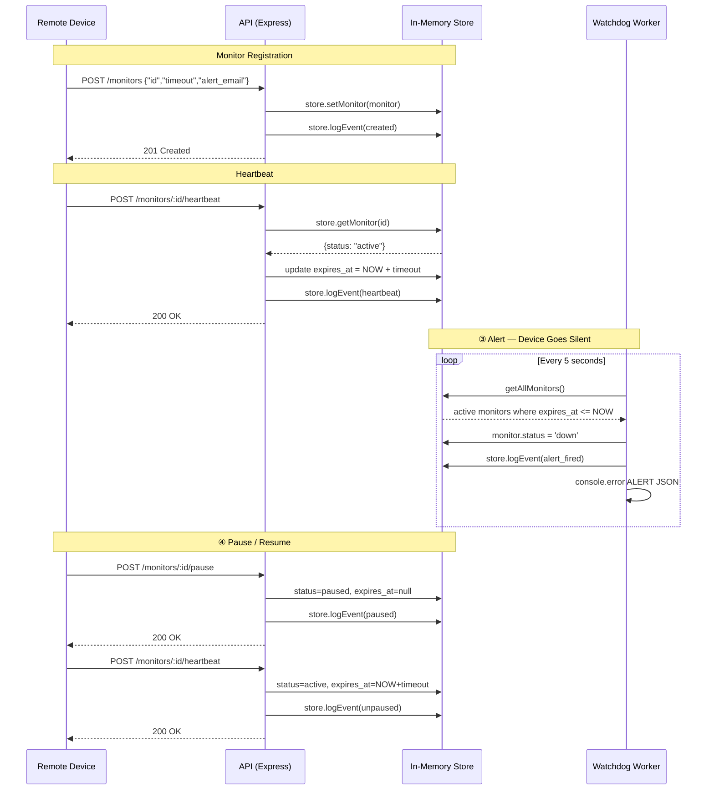

# Pulse-Check API — "Watchdog" Sentinel

> A Dead Man's Switch API for monitoring remote IoT devices at **CritMon Servers Inc.**

---

## The Problem

CritMon monitors remote solar farms and unmanned weather stations in areas with
poor connectivity. Devices send "I'm alive" signals every hour, but there was no
automated way to detect when a device went silent.

**Pulse-Check API** solves this: a device registers a monitor with a countdown
timer. If it fails to send a heartbeat before the timer expires, the Watchdog
automatically fires an alert.

---

## Tech Stack

- **Runtime:** Node.js
- **Framework:** Express.js
- **Database:** PostgreSQL (`pg`)
- **Background Worker:** Native `setInterval`

---

## Architecture

---

## API Endpoints

| Method | Path | Description |
|--------|------|-------------|
| `POST` | `/monitors` | Register a new monitor |
| `POST` | `/monitors/:id/heartbeat` | Send a heartbeat — resets the timer |
| `POST` | `/monitors/:id/pause` | Pause the monitor (no alerts while paused) |
| `GET` | `/monitors/:id/history` | Full event audit log |