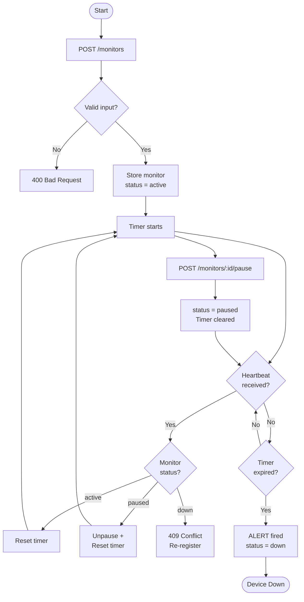

# Pulse-Check API — "Watchdog" Sentinel

> A Dead Man's Switch API for monitoring remote IoT devices at **CritMon Servers Inc.**

---

## The Problem

CritMon monitors remote solar farms and unmanned weather stations in areas with
poor connectivity. Devices send "I'm alive" signals every hour, but there was no
automated way to detect when a device went silent.

**Pulse-Check API** solves this: a device registers a monitor with a countdown
timer. If it fails to send a heartbeat before the timer expires, the Watchdog
automatically fires an alert.

---

## Tech Stack

- **Runtime:** Node.js v18+
- **Framework:** Express.js
- **Store:** In-memory (no database required)
- **Background Worker:** Native `setInterval`

---

## Architecture

### How It Works

The system has three parts that work together which are:

1. **The API** receives requests from devices and updates the in-memory store accordingly.
2. **The In-Memory Store** holds the state of every monitor — its status, countdown timer, and full event history — for the lifetime of the process.
3. **The Watchdog Worker** runs every 5 seconds in the background. It scans all active monitors and fires an alert for any whose timer has expired.


### Flowchart


---

## Setup

### Prerequisites

- Node.js v18+

### 1. Clone & Install

```bash
git clone https://github.com/Kelsey-SG/pulse-check-api.git
cd pulse-check-api
npm install
```

### 2. Start the Server

```bash
npm start
```

You should see:
```
API running on http://localhost:3000
Watchdog armed — polling every 5s
```

The server is now ready to accept requests. Now, leave this terminal open because it is where alert logs will appear when a device goes silent.

> **Note:** State is held in memory, so it will reset when the server restarts.

---

## API Documentation

### POST `/monitors`
Registers a new monitor and starts the countdown timer. If the monitor ID already exists, it re-registers and resets it to active.

**Request body:**
```json
{
  "id": "solar-farm-01",
  "timeout": 60,
  "alert_email": "ops@critmon.com"
}
```

| Field | Type | Description |
|-------|------|-------------|
| `id` | string | Unique identifier for the device |
| `timeout` | integer | Countdown duration in seconds (must be > 0) |
| `alert_email` | string | Email to notify if the device goes silent |

**Response `201 Created`:**
```json
{
  "message": "Monitor 'solar-farm-01' registered. Watchdog armed.",
  "monitor": {
    "id": "solar-farm-01",
    "timeout_seconds": 60,
    "alert_email": "ops@critmon.com",
    "status": "active",
    "expires_at": "2026-06-09T19:00:00.000Z",
    "created_at": "2026-06-09T18:59:00.000Z"
  }
}
```

**Error `400 Bad Request`** — returned when any field is missing or invalid.

---

### POST `/monitors/:id/heartbeat`
Resets the countdown timer for an active monitor. Also un-pauses a paused monitor and restarts its timer.

**Response `200 OK`:**
```json
{
  "message": "Heartbeat received. Timer reset for 'solar-farm-01'.",
  "monitor": {
    "id": "solar-farm-01",
    "status": "active",
    "expires_at": "2026-06-09T19:01:00.000Z"
  }
}
```

**Error `404 Not Found`** — returned when the monitor ID does not exist.

**Error `409 Conflict`** — returned when the monitor is already `down`. Re-register it via `POST /monitors` to restart.

---

### POST `/monitors/:id/pause`
Pauses the countdown timer. No alert will fire while a monitor is paused. Send a heartbeat to resume.

**Response `200 OK`:**
```json
{
  "message": "Monitor 'solar-farm-01' paused. No alerts will fire. Send a heartbeat to resume.",
  "monitor": {
    "id": "solar-farm-01",
    "status": "paused"
  }
}
```

**Error `404 Not Found`** — returned when the monitor ID does not exist.

**Error `409 Conflict`** — returned when the monitor is already paused or is `down`.

---

### GET `/monitors/:id/history`
Returns the full event audit log for a monitor in chronological order.

**Query parameters (optional):**

| Parameter | Description |
|-----------|-------------|
| `event_type` | Filter by event type: `created`, `heartbeat`, `paused`, `unpaused`, `alert_fired` |
| `limit` | Max number of events to return (default: 100, max: 500) |

**Response `200 OK`:**
```json
{
  "monitor_id": "solar-farm-01",
  "event_count": 4,
  "filters": {
    "limit": 100,
    "event_type": "all"
  },
  "events": [
    { "event_id": 1, "event_type": "created", "details": {}, "created_at": "2026-06-09T18:59:00.000Z" },
    { "event_id": 2, "event_type": "heartbeat", "details": {}, "created_at": "2026-06-09T18:59:30.000Z" },
    { "event_id": 3, "event_type": "paused", "details": {}, "created_at": "2026-06-09T18:59:45.000Z" },
    { "event_id": 4, "event_type": "alert_fired", "details": {}, "created_at": "2026-06-09T19:00:00.000Z" }
  ]
}
```

**Error `404 Not Found`** — returned when the monitor ID does not exist.

---

## Developer's Choice — Monitor History Log

**What I added:** `GET /monitors/:id/history`

**Why I added it:** This endpoint is to help engineers understand how a device went from being “up” to “down”. Some examples of this are:

- A device going down because it failed to connect upon registration to the monitoring system. 
- A device going down because the monitor that “owns” the device was paused for maintenance and never resumed.
- A device going down because an alert is continually fired, suggesting that the device might be faulty.

By adding this history functionality to the system, it becomes significantly more useful to the engineers who must respond to those alerts. Instead of being able to understand only the current state of a device, the engineers can now also understand the history of each state that the device has gone through.

**Implementation:**
The endpoint exposes the history of all state changes for a device by specifying the device ID in the URL. The system tracks every state change including created, heartbeat, paused, unpaused, and alert_fired. Each state change is stored in the in-memory store for the system. Finally, the history endpoint can return all of the changes for a specific device and can apply filters to view only certain types of changes (by the event_type parameter) and can also limit the number of changes to be returned (by the limit parameter).